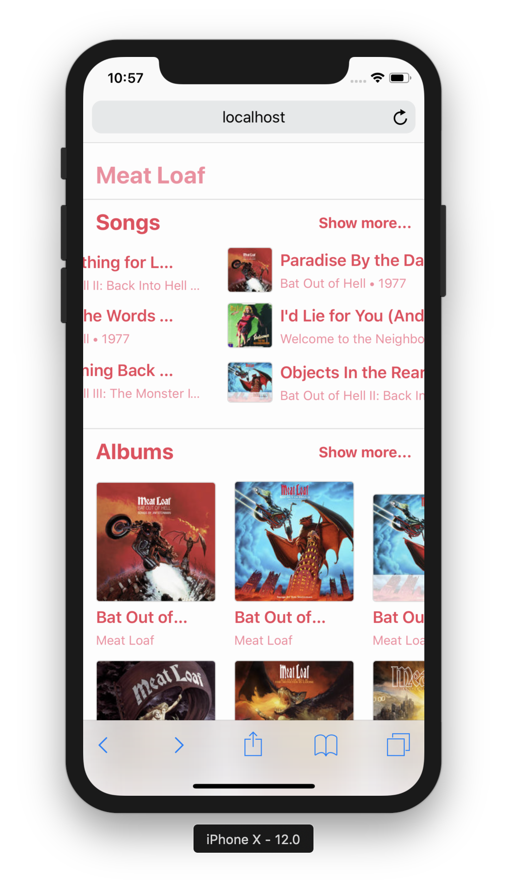

# [Muzika](https://github.com/jb1905/Muzika)

## About
React.js app build with iTunes API. Muzika allows You search music in iTunes, display artist, album, song (with lyrics) pages. App contains [dark mode](https://github.com/jb1905/darky.js).

## Screens

